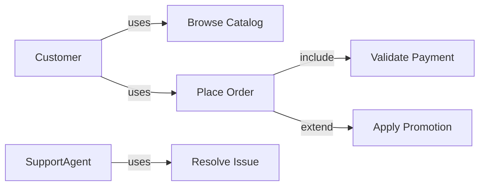
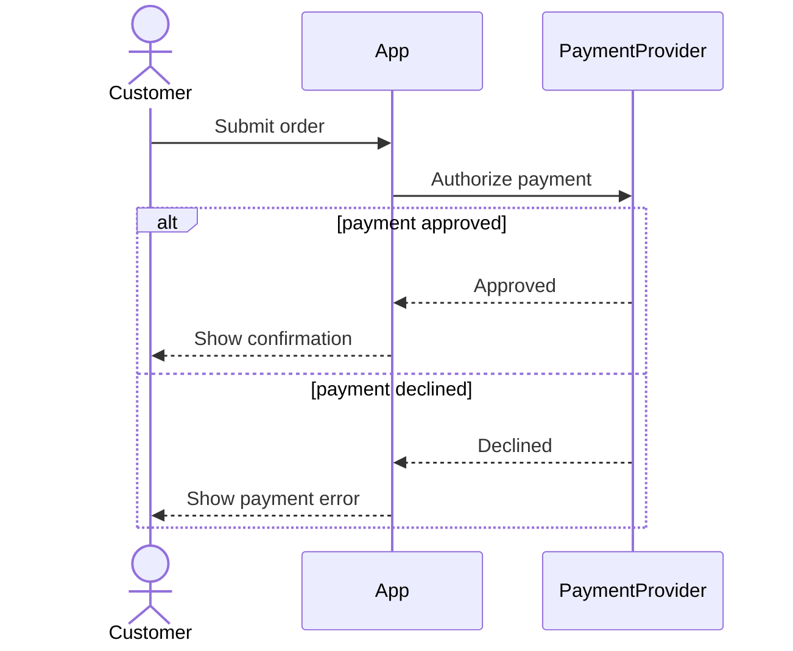
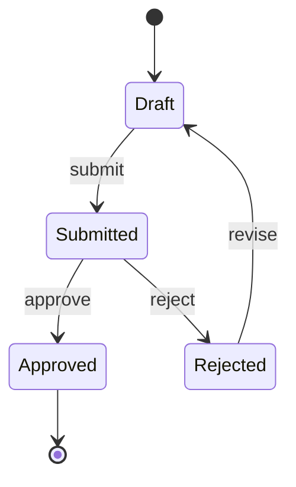

# Creating Diagrams

Create clear diagrams for Product Owner communication and downstream delivery work.

## Hard Gates

- Do not generate a diagram until the context, diagram type, and output format are clear.
- Do not write a file until the user approves the diagram and confirms the output path.
- Do not run version-control actions.

## Workflow

1. **Understand context**
   - Read related specs, requirements, use cases, business flows, and existing diagrams.
   - If context is insufficient, ask one clarifying question at a time.

2. **Choose diagram type**
   - If not specified, ask the user to choose one or more:
     - Use Case Diagram
     - Sequence Diagram
     - BPMN / business process flow
     - Activity Diagram
     - State Diagram
     - Other

3. **Choose output format**
   - Mermaid: recommended default for Markdown, GitHub, GitLab, Notion, and VS Code previews.
   - PlantUML: useful for complex UML and teams with PlantUML tooling.
   - BPMN 2.0 XML: use when the user explicitly needs a standards-based BPMN artifact for BPMN tooling.
   - ASCII: use only for quick sketches or environments with no renderer.

4. **Use research fallback when needed**
   - If the requested diagram type or notation is not covered locally, research current common syntax/structure when web access is available.
   - Cite sources when the environment supports citations.
   - State assumptions before presenting the diagram.
   - If web access is unavailable, say current-source verification was not possible and use a conservative notation.

5. **Generate, review, and save**
   - Generate the diagram with readable labels and domain-specific names from context.
   - Include happy path first, then alternate or exception paths where appropriate.
   - Present for approval.
   - After approval, ask where to save it.
   - Suggested folder: `docs/diagrams/`.

## Diagram Guidance

### Use Case Diagram

Show actors outside the system boundary and use cases inside it. Include associations and use `include` / `extend` only when the relationship is meaningful.

Mermaid example:

### Sequence Diagram

Show message order between actors and systems. Use `alt`, `opt`, and `loop` for conditional, optional, and repeated behavior.

Mermaid example:

### BPMN / Business Process Flow

- Mermaid flowcharts are **BPMN-style**, not BPMN 2.0 compliant XML.
- If the user asks for standards-based BPMN, generate BPMN 2.0 XML or ask for the required tooling constraints.
- Include roles/swimlanes conceptually, start/end events, tasks, and gateways.

Mermaid BPMN-style example:

### Activity Diagram

Use for activity and decision flow within a use case. Mermaid `flowchart` is usually enough unless the user needs UML-specific notation.

### State Diagram

Use for lifecycle states of an entity. Include allowed transitions and terminal states.

Mermaid example:

