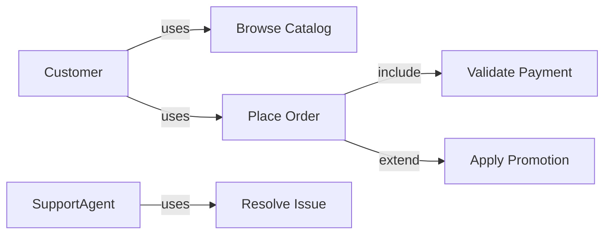
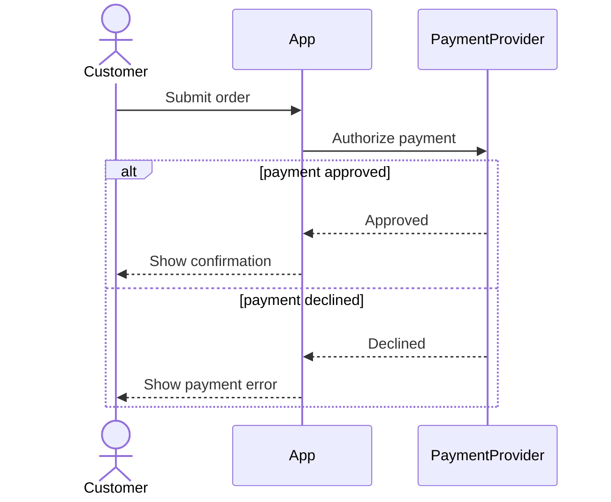
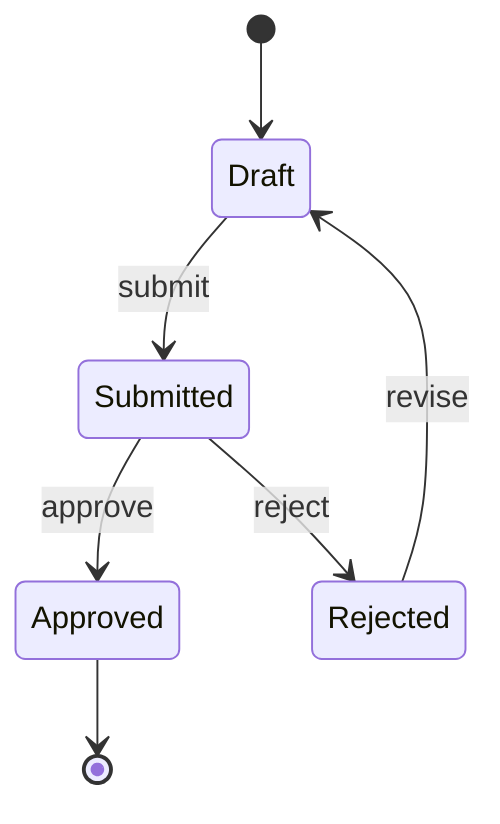

# Creating Diagrams

Create clear diagrams for Product Owner communication and downstream delivery work.

## Hard Gates

- Do not generate a diagram until the context, diagram type, and output format are clear.
- Do not write a file until the user approves the diagram and confirms the output path.
- Do not run version-control actions.
- For draw.io output: read `templates/drawio-style-guide.md` **before** generating any XML. Apply all adaptive theme rules and pre-save checklist. Do not skip.
- Do not send diagram source, labels, screenshots, or project context to public renderers, diagram websites, paste services, or third-party AI services. Do not use public PlantUML servers, Mermaid Live, dbdiagram.io, or similar services to validate or render project data.
- Use only local rendering or validation tools already available in the environment. Do not install a dependency unless the user explicitly asks.

## Workflow

1. **Understand context**
   - Read related specs, requirements, use cases, business flows, and existing diagrams.
   - If context is insufficient, ask one clarifying question at a time.

2. **Create a diagram fact list**
   - Extract and confirm the system boundary, actors or lanes, entities, trigger, happy path, alternate paths, error paths, decisions, terminal outcomes, and assumptions.
   - Keep this list as the review baseline. A valid diagram is not complete if it omits a fact from the confirmed baseline.
   - If a required fact is unknown, ask one focused question at a time.

3. **Choose diagram type**

   | Need | Recommended type | Guardrail |
   |---|---|---|
   | Scope, actors, and user goals | Use Case | Keep actors outside the boundary. Use `include` or `extend` only for meaningful UML relationships. |
   | Ordered calls between people and systems | Sequence | Use `alt`, `opt`, and `loop` for alternate, optional, and repeated paths. Split the diagram if it has more than 8 participants or 15 main messages. |
   | Decision-based workflow within a use case | Activity or flowchart | Give every decision an explicit outcome and ensure every path reaches an end, merge, or documented loop. |
   | Workflow with 3 or more roles and cross-role handoffs | Swimlane activity | Use lanes to make ownership explicit. Do not use decorative groups as a substitute for lanes. |
   | Standard process artifact for Camunda, Bizagi, or another BPMN tool | BPMN 2.0 XML | Confirm the target tool and its import requirements. Mermaid flowcharts are not BPMN 2.0. |
   | Lifecycle of an entity | State | Use when the entity has at least 3 meaningful states. Show triggers, allowed transitions, invalid transitions where relevant, and terminal states. |
   | Conceptual data model | ERD | Show entities, cardinality, identifiers, and only attributes needed for the stated audience. |
   | System components and integrations | Architecture or component diagram | Keep the abstraction level consistent. Do not mix business steps with infrastructure deployment details. |

   - If the user has not specified a type, recommend one based on this table and state why.

4. **Choose output format**
   - **draw.io** (`.drawio` XML): recommended when the user needs a file they can open, edit, and share. Default choice when no format is specified and a file output is needed.
   - Mermaid: recommended for Markdown, GitHub, GitLab, Notion, and VS Code previews where inline rendering is preferred.
   - PlantUML: useful for complex UML and teams with PlantUML tooling.
   - BPMN 2.0 XML: use when the user explicitly needs a standards-based BPMN artifact for BPMN tooling.
   - ASCII: use only for quick sketches or environments with no renderer.

5. **If output is draw.io — apply style rules before generating**
   - Read `templates/drawio-style-guide.md` fully.
   - Apply adaptive theme rules: do NOT hardcode `fontColor` or `strokeColor` on canvas-level elements (arrows, lifelines, floating labels).
   - DO hardcode `fontColor=#333333` on all in-box elements (actors, notes, phase headers, swimlanes).
   - Follow layout and spacing rules: minimum gaps between elements, minimum box sizes.
   - Run the Pre-Save Checklist from the style guide before finalising the XML.

6. **Use research fallback when needed**
   - If the requested diagram type or notation is not covered locally, research current common syntax/structure when web access is available.
   - Cite sources when the environment supports citations.
   - State assumptions before presenting the diagram.
   - If web access is unavailable, say current-source verification was not possible and use a conservative notation.

7. **Generate, review, validate, and save**
   - Generate the diagram with readable labels and domain-specific names from context.
   - Include happy path first, then alternate or exception paths where appropriate.
   - For draw.io: validate XML structure — file must start with `<mxGraphModel>`, all IDs must be unique, no two elements may overlap.
   - Run three distinct checks before reporting completion:
     1. **Syntax or structure**: validate draw.io XML, or run an installed local renderer or CLI for Mermaid, PlantUML, D2, DBML, or BPMN 2.0. If no local validator is available, state that runtime validation was not performed.
     2. **Business coverage**: compare the diagram with the fact list. Check all actors or lanes, decisions and outcomes, alternate or error paths, terminal states, and critical relationships.
     3. **Readability**: check label length, consistent direction, unclipped text, crossings or overlaps, and one consistent abstraction level. Split the diagram when readability cannot be preserved.
   - Present for approval (show XML in a code block or summarise the element count and structure).
   - After approval, ask where to save it.
   - Suggested folder: `docs/diagrams/`.

## Diagram Guidance

### Use Case Diagram

Show actors outside the system boundary and use cases inside it. Include associations and use `include` / `extend` only when the relationship is meaningful.

Mermaid example:

### Sequence Diagram

Show message order between actors and systems. Use `alt`, `opt`, and `loop` for conditional, optional, and repeated behavior.

Mermaid example:

### BPMN / Business Process Flow

- Mermaid flowcharts are **BPMN-style**, not BPMN 2.0 compliant XML.
- If the user asks for standards-based BPMN, generate BPMN 2.0 XML or ask for the required tooling constraints.
- Include roles/swimlanes conceptually, start/end events, tasks, and gateways.

Mermaid BPMN-style example:

### Activity Diagram

Use for activity and decision flow within a use case. Mermaid `flowchart` is usually enough unless the user needs UML-specific notation.

### State Diagram

Use for lifecycle states of an entity. Include allowed transitions and terminal states.

Mermaid example:

## Draw.io Rules (summary — full detail in `templates/drawio-style-guide.md`)

### Adaptive Theme — Must Follow

| Element location | fontColor | strokeColor |
|---|---|---|
| On canvas (arrow label, lifeline, UML actor label, floating text) | ❌ Do NOT set | ❌ Do NOT set |
| Inside a box (actor, note, phase header, swimlane) | ✅ `#333333` | ✅ Semantic zone color |
| Semantic line (error/success arrow) | ❌ Do NOT set | ✅ Semantic color only |

### Zone Color Palette

| Zone | fillColor | strokeColor |
|---|---|---|
| 🟢 User / Client | `#d5e8d4` | `#82b366` |
| 🔵 Core System | `#dae8fc` | `#6c8ebf` |
| 🟣 Backend | `#e1d5e7` | `#9673a6` |
| 🟡 External / Batch | `#fff2cc` | `#d6b656` |
| 🔴 Critical / Error | `#f8cecc` | `#b85450` |
| ⬜ Infra / DB | `#F5F5F5` | `#999999` |

### Layout Rules

- Minimum **30px horizontal gap** between adjacent boxes on the same row.
- Minimum **40px vertical gap** between rows.
- Every box must be large enough to display its label without clipping.
- Arrow labels that overlap a box must use `labelBackgroundColor=#ffffff` or be repositioned.
- Check for coordinate overlap before finalising XML.
