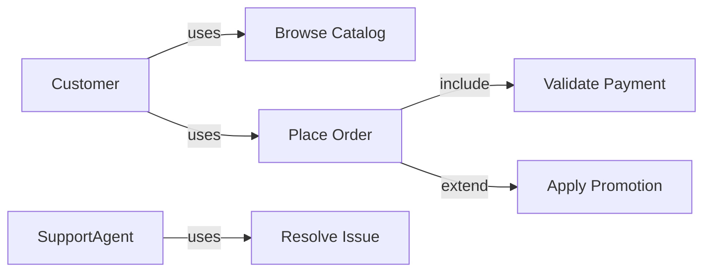
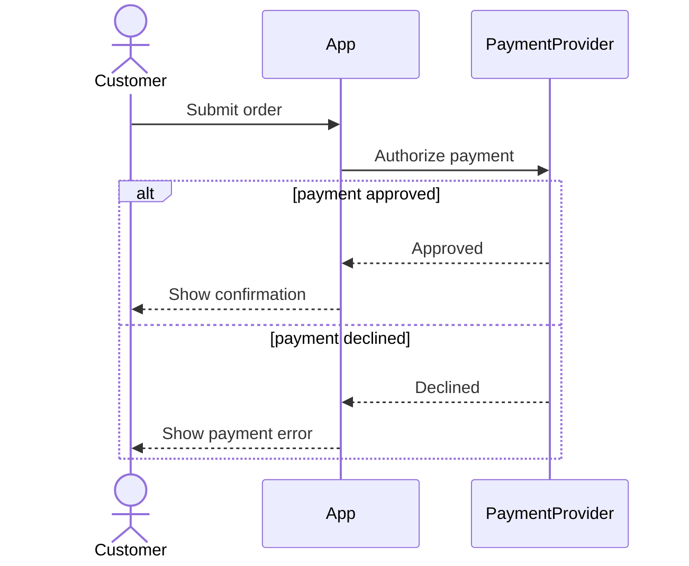
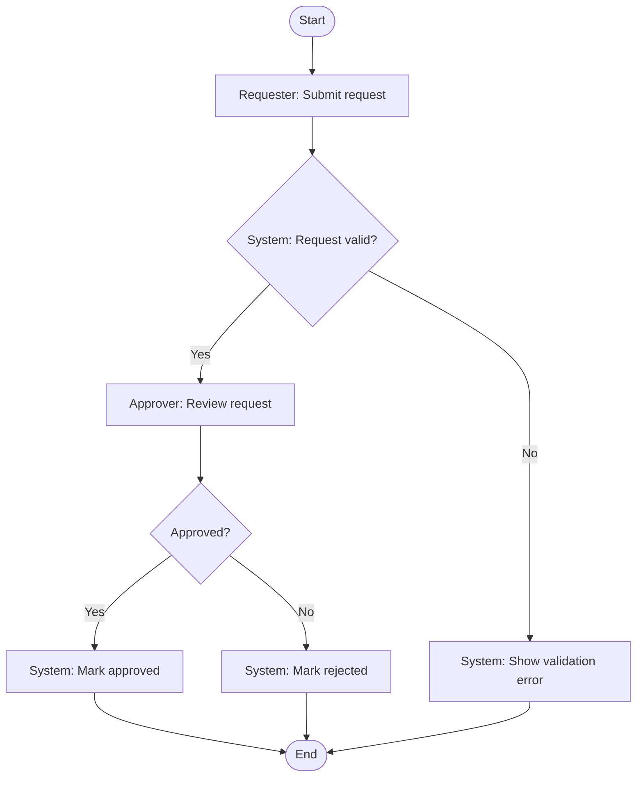
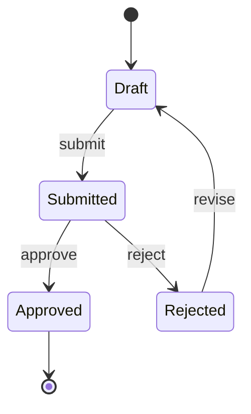

# Creating Diagrams

Create clear diagrams for Product Owner communication and downstream delivery work.

## Hard Gates

- Do not generate a diagram until the context, diagram type, and output format are clear.
- Do not write a file until the user approves the diagram and confirms the output path.
- Do not run version-control actions.
- For draw.io output: read `templates/drawio-style-guide.md` **before** generating any XML. Apply all adaptive theme rules and pre-save checklist. Do not skip.

## Workflow

1. **Understand context**
   - Read related specs, requirements, use cases, business flows, and existing diagrams.
   - If context is insufficient, ask one clarifying question at a time.

2. **Choose diagram type**
   - If not specified, ask the user to choose one or more:
     - Use Case Diagram
     - Sequence Diagram
     - BPMN / business process flow
     - Activity Diagram
     - State Diagram
     - Other

3. **Choose output format**
   - **draw.io** (`.drawio` XML): recommended when the user needs a file they can open, edit, and share. Default choice when no format is specified and a file output is needed.
   - Mermaid: recommended for Markdown, GitHub, GitLab, Notion, and VS Code previews where inline rendering is preferred.
   - PlantUML: useful for complex UML and teams with PlantUML tooling.
   - BPMN 2.0 XML: use when the user explicitly needs a standards-based BPMN artifact for BPMN tooling.
   - ASCII: use only for quick sketches or environments with no renderer.

4. **If output is draw.io — apply style rules before generating**
   - Read `templates/drawio-style-guide.md` fully.
   - Apply adaptive theme rules: do NOT hardcode `fontColor` or `strokeColor` on canvas-level elements (arrows, lifelines, floating labels).
   - DO hardcode `fontColor=#333333` on all in-box elements (actors, notes, phase headers, swimlanes).
   - Follow layout and spacing rules: minimum gaps between elements, minimum box sizes.
   - Run the Pre-Save Checklist from the style guide before finalising the XML.

5. **Use research fallback when needed**
   - If the requested diagram type or notation is not covered locally, research current common syntax/structure when web access is available.
   - Cite sources when the environment supports citations.
   - State assumptions before presenting the diagram.
   - If web access is unavailable, say current-source verification was not possible and use a conservative notation.

6. **Generate, review, and save**
   - Generate the diagram with readable labels and domain-specific names from context.
   - Include happy path first, then alternate or exception paths where appropriate.
   - For draw.io: validate XML structure — file must start with `<mxGraphModel>`, all IDs must be unique, no two elements may overlap.
   - Present for approval (show XML in a code block or summarise the element count and structure).
   - After approval, ask where to save it.
   - Suggested folder: `docs/diagrams/`.

## Diagram Guidance

### Use Case Diagram

Show actors outside the system boundary and use cases inside it. Include associations and use `include` / `extend` only when the relationship is meaningful.

Mermaid example:

### Sequence Diagram

Show message order between actors and systems. Use `alt`, `opt`, and `loop` for conditional, optional, and repeated behavior.

Mermaid example:

### BPMN / Business Process Flow

- Mermaid flowcharts are **BPMN-style**, not BPMN 2.0 compliant XML.
- If the user asks for standards-based BPMN, generate BPMN 2.0 XML or ask for the required tooling constraints.
- Include roles/swimlanes conceptually, start/end events, tasks, and gateways.

Mermaid BPMN-style example:

### Activity Diagram

Use for activity and decision flow within a use case. Mermaid `flowchart` is usually enough unless the user needs UML-specific notation.

### State Diagram

Use for lifecycle states of an entity. Include allowed transitions and terminal states.

Mermaid example:

## Draw.io Rules (summary — full detail in `templates/drawio-style-guide.md`)

### Adaptive Theme — Must Follow

| Element location | fontColor | strokeColor |
|---|---|---|
| On canvas (arrow label, lifeline, UML actor label, floating text) | ❌ Do NOT set | ❌ Do NOT set |
| Inside a box (actor, note, phase header, swimlane) | ✅ `#333333` | ✅ Semantic zone color |
| Semantic line (error/success arrow) | ❌ Do NOT set | ✅ Semantic color only |

### Zone Color Palette

| Zone | fillColor | strokeColor |
|---|---|---|
| 🟢 User / Client | `#d5e8d4` | `#82b366` |
| 🔵 Core System | `#dae8fc` | `#6c8ebf` |
| 🟣 Backend | `#e1d5e7` | `#9673a6` |
| 🟡 External / Batch | `#fff2cc` | `#d6b656` |
| 🔴 Critical / Error | `#f8cecc` | `#b85450` |
| ⬜ Infra / DB | `#F5F5F5` | `#999999` |

### Layout Rules

- Minimum **30px horizontal gap** between adjacent boxes on the same row.
- Minimum **40px vertical gap** between rows.
- Every box must be large enough to display its label without clipping.
- Arrow labels that overlap a box must use `labelBackgroundColor=#ffffff` or be repositioned.
- Check for coordinate overlap before finalising XML.
