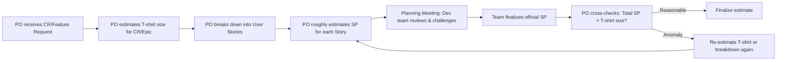

# Estimation Guide

> Estimation guide for requirement artifacts. This document ensures consistency when estimating effort across levels: **Epic / Change Request** and **User Story**.

## 1. Estimation System Overview

Use **2 parallel scales**, each serving a different purpose:

| Level | Scale | Values | Purpose |
|---|---|---|---|
| **Change Request / Epic** | T-shirt Sizing | XS / S / M / L / XL / XXL | Rough estimation for Roadmap Planning, Impact Assessment |
| **User Story** | Story Points (Fibonacci) | 1 / 2 / 3 / 5 / 8 / 13 | Sprint Planning, Velocity Tracking |

> [!IMPORTANT]
> **Core rule:** T-shirt sizing is used when assessing overall scope. Story Points are used when breaking down into specific User Stories. The two scales have a reference conversion table (Section 4) but **cannot substitute** for each other.

---

## 2. Story Point — Definition

### What does a Story Point measure?

A Story Point is a **relative** unit of measurement reflecting a combination of 3 factors:

| Factor | Weight | Explanation |
|---|---|---|
| **Complexity** | High | Number of affected components, business logic complexity, number of edge cases |
| **Effort** | Medium | Amount of code, number of screens, APIs, tests to write |
| **Uncertainty** | Low–Medium | Clarity of requirements, external dependencies, unverified technical risks |

### Fibonacci Scale

Uses the extended Fibonacci sequence: **1, 2, 3, 5, 8, 13**

| SP | General Description |
|---|---|
| **1** | Very small change, completely clear, almost zero risk. Example: change label, update wording, add 1 field displaying existing data. |
| **2** | Small change, low complexity, simple logic. Example: add a single validation rule, show/hide element based on a simple condition. |
| **3** | Moderate change, clear logic but touches more than 1 layer (UI + API or UI + DB). Example: add new filter to a list, add field to form with validation. |
| **5** | Significant change, many edge cases or complex business rules. Example: create a complete new screen, redesign processing flow with state machine. |
| **8** | Large change, cross-module, many dependencies. Example: new feature affecting 2–3 modules, requires data migration. |
| **13** | Very large and complex, consider breakdown. Example: new sub-system, affects entire architecture, many unknowns. |

> [!WARNING]
> **If a User Story is estimated ≥ 13 SP**, it is a signal that the story needs to be **broken down further** into smaller stories. A story ≥ 13 SP is usually too large to complete in 1 Sprint.

---

## 3. T-shirt Sizing — Definition

T-shirt sizing is used at the **Change Request** and **Epic** level to quickly assess total effort before breaking down into User Stories.

| Size | Description | Reference Scope |
|---|---|---|
| **XS** | Micro change, 1 small story | Wording update, config change |
| **S** | Small, 1–2 simple stories | Minor UI change, show/hide element, single logic update |
| **M** | Medium, 2–4 stories | New feature in 1 module, redesign 1 screen |
| **L** | Large, 4–6 stories, cross-module | New feature affecting 2–3 modules, needs migration |
| **XL** | Very large, 6–10 stories | Complex epic, affects many modules and integration |
| **XXL** | Epic needs breakdown into sub-epics | New sub-system, architecture overhaul |

> [!WARNING]
> **If a CR/Epic is estimated XXL**, consider splitting it into multiple sub-CRs/Epics before starting development.

---

## 4. T-shirt ↔ Story Points Conversion Table

This table is used for **reference** when you need to compare or verify the reasonableness between an estimate at the Epic level and the total SP of its child User Stories.

| T-shirt | Corresponding SP (sum of child stories) | Notes |
|---|---|---|
| **XS** | ~1 | 1 single small story |
| **S** | ~2–3 | 1–2 simple stories |
| **M** | ~5 | 2–4 stories total |
| **L** | ~8 | 4–6 stories, cross-module |
| **XL** | ~13 | 6–10 complex stories |
| **XXL** | ≥20 | **Must be broken down further** before detailed estimation |

> [!TIP]
> This conversion table **is not an exact formula**. The goal is to spot anomalies: if 1 CR is size **S** but the total SP of its child stories reaches **13**, that's a sign the initial sizing was inaccurate and needs re-estimation.

---

## 5. Reference Stories (Anchor Stories)

> [!NOTE]
> This section needs to be **customized for each project**. Choose real stories from your project as reference points for each SP level.

### 🟢 Baseline (1 SP)
- **Example:** [Describe a very small, clear story in your project]
- **Characteristics:** 1 file, 1 edit location, no logic change.

### 🟡 Small (2–3 SP)
- **Example:** [Describe a small story with simple logic]
- **Characteristics:** Conditional UI change, needs simple business rule check, affects 1 module.

### 🟠 Medium (5 SP)
- **Example:** [Describe a medium story, touching multiple layers]
- **Characteristics:** Add new fields to DB, UI layout change, needs backward compatibility, affects API.

### 🔴 Large (8 SP)
- **Example:** [Describe a large, cross-module story]
- **Characteristics:** Complete redesign of 1 screen, deprecate 1 old flow, cross-module impact.

### ⚫ Very Large (13 SP — needs breakdown consideration)
- **Example:** [Describe a very large story that should be split]
- **Characteristics:** Deep cross-module impact, many undecided decisions, many unknowns → **should breakdown**.

---

## 6. Estimation Process

### Detailed Steps:

| Step | Owner | Action | Output |
|---|---|---|---|
| 1 | **PO** | Receive CR/Feature Request, assess overall scope | T-shirt size (S/M/L/XL) recorded in CR |
| 2 | **PO** | Break down CR into User Stories | List of US in Epic/CR |
| 3 | **PO** | Roughly estimate SP for each story based on Reference Table | SP recorded in metadata of each US |
| 4 | **Dev Team** | Review, challenge, propose SP changes in Planning Meeting | Consensus-based SP |
| 5 | **PO** | Cross-check: total SP of child stories ≈ original T-shirt size? | Confirm or re-estimate |

> [!NOTE]
> - PO estimates SP as a **rough estimation** initially, based on experience and the Reference Table.
> - Dev team has the **right to challenge** and finalize the final number at the Planning Meeting.
> - If there's a large discrepancy between PO estimate and Dev estimate, discussion is needed to understand the root cause (unclear requirements? PO underestimated complexity?).

---

## 7. Application Rules

### When writing Change Request / Epic
- Record in the `## Estimation` section with format: `- **Effort**: S` (or M/L/XL/XXL).
- Total SP is not mandatory; T-shirt size is sufficient at this level.

### When writing User Story
- Record in metadata table: `\| Story Points \| 5 \|`.
- Must record SP for every story **before entering the Sprint**.
- If not yet estimated, write `To be estimated`.

### Cross-check rule
- After breaking down, PO should check: **does the total SP of child stories fall within the range** of the original T-shirt size (see Section 4).
- If deviation is >50%, need to re-estimate or adjust scope.
